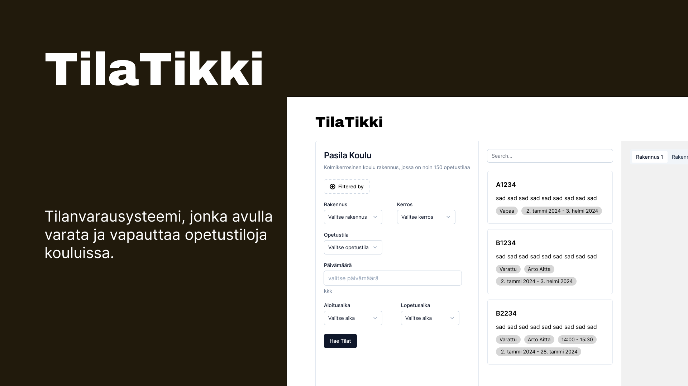

# TilaTikki



TilaTikki is help with over 1.2 million m² of unused classrooms in Helsinki by giving the teachers the ability to reserve and cancel reservation with ease and
help schools to acknowledge what rooms are used

```sh
# Install all dependencies
npm run setup

# Start client & server concurrently
npm run dev
```

```sh
# Build for prod
npm run build
# Start prod server
npm start
```

## Tech use

- React
- express
- MongoDB
- Redux (not using RTK) "Predictable state container for JavaScript apps"
- @react-three/fiber "🇨🇭 A React renderer for Three.js"
- @react-three/drei "🥉 useful helpers for react-three-fiber"
- TailwindCSS "Rapidly build modern websites without ever leaving your HTML"
- shadcn/ui "Beautifully designed components that you can copy and paste into your apps. Accessible. Customizable."
- Vitest "Next generation testing framework powered by Vite"
- TypeScript "Superset of JavaScript that compiles to clean JavaScript output"

[backend database design](https://www.figma.com/file/Mkq2rjNwP50lYfI0qwXVc9/Tilatikki-Figma?type=whiteboard&node-id=0-1&t=fVfQKz3hftcHYhFg-0)

### TODO

- [ ] teacher can reserve a classrom from any school
  - currently only teacher that have been assign to a specific school building can reserve classrooms
- [ ] finish reservation history
- [ ] "school admin" view for the semester plan for bulk reservation
- [ ] school floorplan show up the free rooms after pressing "hae tilat" button
  - if multiple floors have free rooms then show some indication in the tabs that there is free rooms also
  - if you want to simplify the process then require selecting a floor that you want to search free rooms
- [ ] ability to a user to edit user info and delete user (admin also able to delete users not mandatory rn)
- [ ] improve the filtering correctly
- [ ] reservation form will take all the fields account when reserving
- [ ] confirmation of the reservation after submitting or if cancelling the reservation
- [ ] auth is kind of cooked on frontend needs to some work
  - after loging out, it does not redirect back to login page
